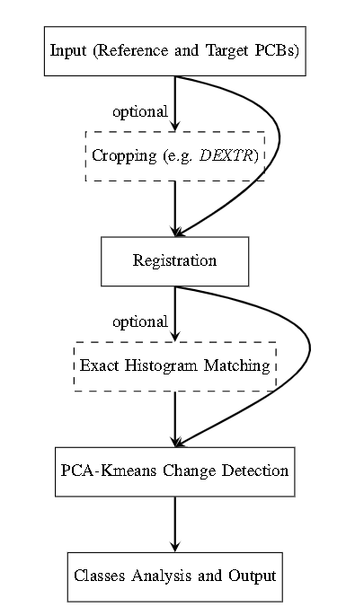
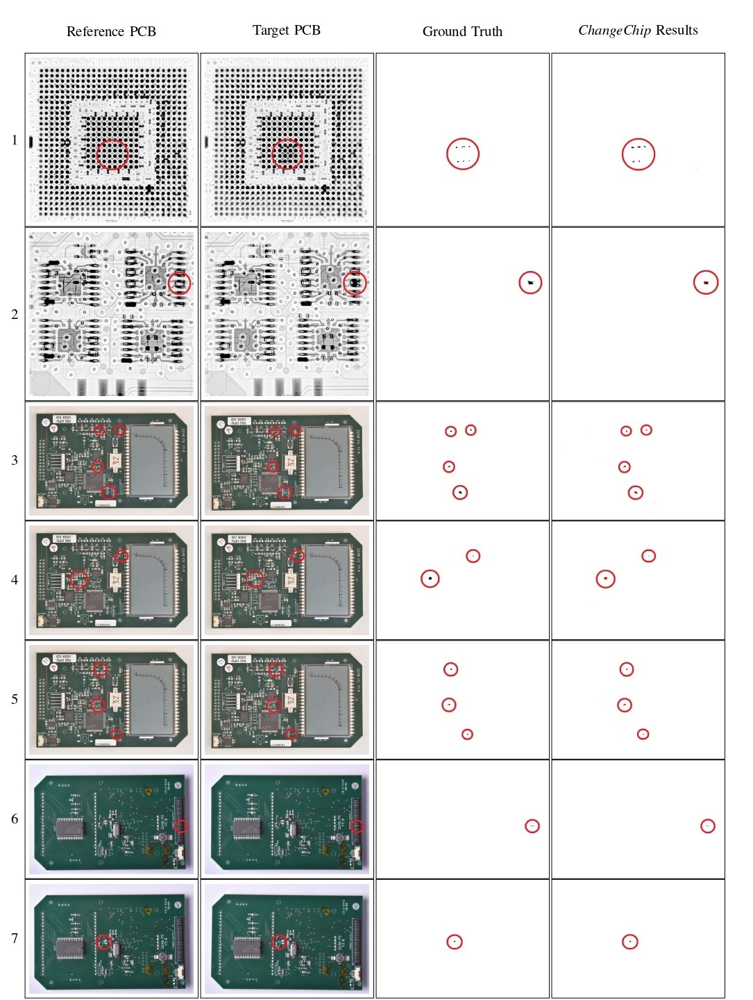
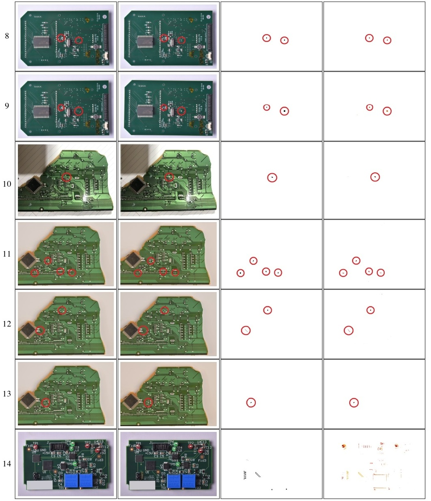

# ChangeChip


*ChangeChip* was developed to detect changes between an inspected PCB image and a reference (golden) PCB image to identify defects. The system is based on Image Processing, Computer Vision, and Unsupervised Machine Learning techniques. *ChangeChip* is designed to handle both optical and radiographic images and can be applied to other technologies as well. It is not limited to PCBs only and may be suitable for other systems requiring object comparison by their images.

The workflow of *ChangeChip* is presented as follows:



## Installation and Usage:

### Using Anaconda

1. Clone the repository:
    ```bash
    git clone https://github.com/yourusername/changechip.git
    cd changechip
    ```

2. Create a conda environment with Python 3.11:
    ```bash
    conda create --name changechip python=3.11
    conda activate changechip
    ```

3. Install the required packages:
    ```bash
    pip install -r requirements.txt
    ```

4. Run the application:
    ```bash
    python app.py
    ```

### Using Docker Compose

1. Clone the repository:
    ```bash
    git clone https://github.com/yourusername/changechip.git
    cd changechip
    ```

2. Run the compose file
    ```
    docker compose up
    ```

Access the application at `localhost:7860`.

## CD-PCB Dataset

As part of this work, a small dataset of 20 pairs of PCB images was created, with annotated changes between them. This dataset is proposed for evaluating change detection algorithms in the PCB inspection field. The dataset is available [here](https://drive.google.com/file/d/1b1GFuKS88nKaH-Nfx2XmlhwulUxMwwBA/view?usp=sharing).

### Example Results

Below are examples of pairs from the CD-PCB dataset, showing the ground truth changes and *ChangeChip* results according to the parameters described in the Results section of the paper. The red circles are for easy identification by the reader.



